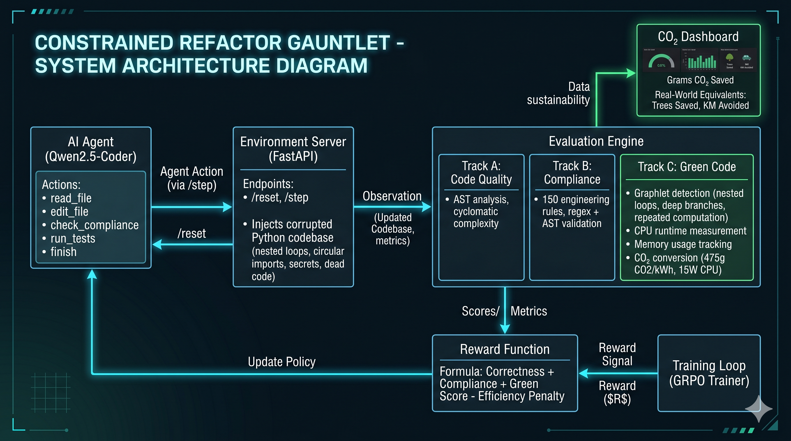
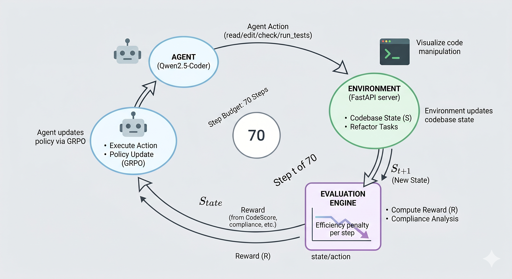

# 🌱 Green-Code Optimizer 🔧

**🌱 Green-Code Optimizer** is an OpenEnv Reinforcement Learning environment where an AI agent refactors a legacy Python codebase while strictly obeying 150 cascading engineering rules, improving code quality, and reducing energy consumption.

This project is a submission for the **Meta PyTorch OpenEnv Hackathon — Long-Horizon Planning & Instruction Following**.

---

## 🎯 The Core Mission

Legacy codebases often harbor unseen inefficiencies like nested loops and deep branches, silently warming the planet by wasting CPU cycles. This environment challenges an AI agent to fix these inefficiencies while adhering to complex and sometimes contradictory engineering standards.

The agent receives a broken legacy Python codebase, has **70 steps to fix it**, and is rewarded not just for correct code, but for code that measurably reduces energy consumption and CO₂ output.

**Reward Formula:**
> `Reward = 0.50 × CodeScore + 0.35 × ComplianceScore + 0.15 × GreenScore`

---

## 🏗️ System Architecture

- **Base Model**: `Qwen/Qwen2.5-Coder-7B-Instruct`
- **Training Method**: GRPO (Group Relative Policy Optimization) via Unsloth
- **Adapter Link**: [shreeyanshi03/constrained-refactor-adapter](https://huggingface.co/shreeyanshi03/constrained-refactor-adapter)



### Three-Track Scoring System
When an episode ends, the environment evaluates the agent across three orthogonal tracks:

- 🛠️ **Track A (Code Quality)**: AST analysis measuring cyclomatic complexity and ensuring tests pass.
- 📜 **Track B (Compliance)**: Blends a regex-based rule engine with direct AST verification to enforce up to 150 dynamically activated engineering rules.
- 🌱 **Track C (Green Code)**: Searches for computationally expensive subgraph patterns (graphlets), validates improvements via CPU/Memory testing, and calculates **grams of CO₂ saved per year**.



---

## 🛡️ Anti-Cheating & Constraints

Models are brilliant at specification gaming. The Gauntlet includes 5 layers of anti-cheating protection:
1. **Protected File Lockdown**: Editing test files instantly terminates the episode (−1.0 reward).
2. **Test Stub Detection**: Replacing tests with `return True` is detected and penalized.
3. **Binary AST Gate**: Every file must parse cleanly. Syntax errors collapse the entire reward.
4. **Forbidden Names**: Bypassing regex rules using nonsensical variables triggers an instant hack penalty.
5. **Assertion Guard**: Deleting all `assert` statements from a file is treated as cheating.

Additionally, a **Step Penalty** is applied to encourage expert-level minimal reads and precise edits rather than exhaustive brute-forcing.

---

## 🚀 Setup & Installation

**1. Clone the repository:**
```bash
git clone https://github.com/bcde123/Meta-Round2.git
cd Meta-Round2
```

**2. Install dependencies:**
```bash
pip install -r requirements.txt
```
*(For docker deployments, use `requirements-docker.txt` and the provided `Dockerfile`)*

**3. Start the FastAPI server:**
```bash
uvicorn server:app --host 0.0.0.0 --port 7860
```

---

## 🌐 API Endpoints

The environment operates via an HTTP API, making it accessible for RL agent interactions and monitoring:

| Endpoint | Method | Description |
|----------|--------|-------------|
| `/` | GET | Project information and metadata. |
| `/health` | GET | System health check (includes GPU status). |
| `/health/green` | GET | Track C green subsystem status. |
| `/docs` | GET | Interactive Swagger UI API documentation. |
| `/reset` | POST | Initialize a new episode (returns state & rules). |
| `/step` | POST | Take an action in the environment (edit, test, read). |
| `/infer` | POST | Run the trained agent on an observation (requires GPU). |
| `/dashboard/co2/{episode_id}` | GET | View the live CO₂ savings dashboard for an episode. |

---

## 🏋️ Training the Agent

If you have a GPU environment (e.g., Lightning Studio, Colab), you can train the agent directly using the provided pipeline.

```bash
# Verify environment setup and components
python training/verify_pipeline.py

# Launch the full GRPO training run
python training/train_grpo.py
```

---

## 📚 Learn More
For an in-depth dive into the carbon footprint of legacy code and the challenges of training this agent, check out the [Full Blog Post](blog_post.md).
