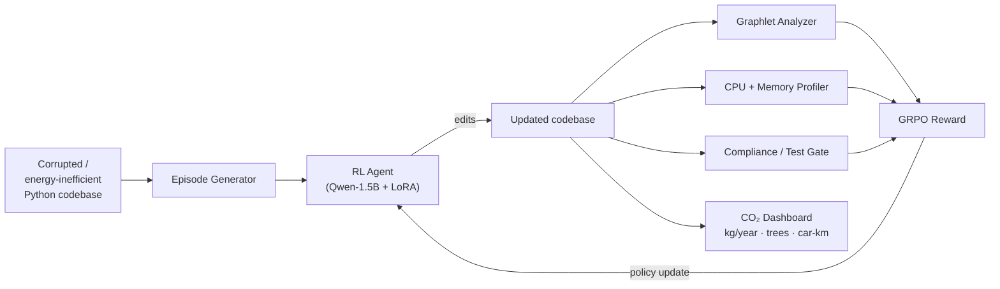

# 🌱 Green-Code Optimizer

> **An RL agent that refactors Python code for energy efficiency, not readability — and tells you exactly how much CO₂ it saves.**

[](https://huggingface.co/spaces/s123hree/constrained-refactor-gauntlet-a100)
[](https://huggingface.co/shreeyanshi03/constrained-refactor-adapter-1.5b)
[](https://github.com/meta-pytorch/openenv)
[](LICENSE)

**Try it in 30 seconds → [Live Demo](https://s123hree-constrained-refactor-gauntlet-a100.hf.space/demo)** &nbsp;·&nbsp; **[CO₂ Dashboard](https://s123hree-constrained-refactor-gauntlet-a100.hf.space/dashboard/co2/demo)**

---

## 🎯 The Problem

AI workloads are projected to consume **2–4 % of global electricity by 2030**. Most of that goes to *training*, but **inference at scale** — the same algorithms running millions of times a day in production — is the silent giant. A single inefficient nested loop in a hot path, replicated across millions of executions, can add up to *real* CO₂.

Meanwhile, almost every existing code-refactoring tool optimises for **readability** (line length, naming, type hints). **None of them refactor for energy.**

> **What if we trained an RL agent whose only goal was to make Python *cheaper to run* — measured in CPU cycles, memory footprint, and ultimately grams of CO₂?**

That's the Green-Code Optimizer.

---

## 💡 The Pitch

| Existing refactoring tools | Green-Code Optimizer |
|----------------------------|----------------------|
| Optimise for readability   | **Optimise for energy** |
| Style / naming / lint      | **CPU time + peak memory** |
| Subjective rules            | **Measurable, runtime-grounded reward** |
| Outputs cleaner code        | **Outputs cheaper code + a CO₂ dashboard** |

The agent receives a **negative reward for high peak memory and high execution time**, and a positive reward for the *opposite*. It uses **graphlet analysis** to represent the program's control-flow structure, so it learns which structural patterns (nested loops, function calls inside loops, deep branching) are expensive — and swaps them for cheap alternatives (vectorised ops, comprehensions, hoisted invariants).

---

## 👀 Concrete Example

A real corruption from the env (Level-1 episode):

**Before** — a list comprehension is exploded into an append-loop, *and* a 50-iteration energy-waste loop is injected at the top:
```python
def get_priority_users(users):
    _energy_waste = []
    for _ in range(50):
        _energy_waste.append(list(range(100)))
    out = []
    for u in users:
        out.append(u.upper())
    return out
```

**After** — the agent's target refactor:
```python
def get_priority_users(users):
    return [u.upper() for u in users]
```

**Impact (at 10 000 runs/day):** ~**1.1 kg CO₂/year** saved per call site. With one trained agent and a few thousand call sites, you're talking about *trees worth* of carbon.

---

## ⚙️ How It Works



### 1. Episode Generation with **Curriculum-Driven Corruption**

Each episode loads a real Python codebase and applies **energy-degrading corruptions** that scale with the agent's skill:

| Curriculum level | Energy corruptions | Readability corruptions | Active rules |
|-----------------:|:-------------------|:------------------------|-------------:|
| 1 (warmup) | 1 | 1 | 20 |
| 2 | 2 | 2 | 60 |
| 3 | 3 (all) | 3 | 100 |
| 4 (expert) | 3 (all, 2× passes) | 4 | 140 |

The `CurriculumManager` escalates the level once 3 consecutive 50-episode windows all average a reward > 0.7 — so the agent's *own progress* drives the difficulty.

### 2. Graphlet Analysis — `environment/graphlet_analyzer.py`
Parses each file into an AST and detects 4 classes of expensive control-flow graphlets:

| Graphlet | Cost weight | Example |
|----------|------------:|---------|
| `NestedLoop` | 3.0 | `for i: for j: ...` |
| `LoopWithCall` | 1.5 | `for x: f(x)` |
| `DeepBranch` | 2.0 | `if … if … if …` (≥ 3 deep) |
| `RepeatedComprehension` | 1.0 | Multiple list-comps in one fn |

Lower total cost → higher graphlet score (range `[0, 1]`).

### 3. Runtime Profiling — `environment/track_c.py`
Each candidate refactor is **actually executed** in a sandbox: CPU time via `timeit`, peak memory via `tracemalloc`. Improvements vs. the original are clamped to `[0, 1]`.

### 4. Reward Function — `training/train_grpo.py`
```
R = S_test × (0.70·green_score + 0.30·compliance_score) − P_efficiency
```
- **`S_test ∈ {0, 1}`** — hard gate: if the refactored code doesn't parse, the agent gets **0**. No reward for "cleaner" code that doesn't work.
- **`green_score`** (70 %) — composite of `graphlet_score`, `cpu_improvement`, `memory_improvement`.
- **`compliance_score`** (30 %) — secondary correctness signal from 150 engineering rules.
- **`P_efficiency`** — `0.01` per file edited; pushes the agent toward minimal, surgical edits.

### 5. CO₂ Dashboard — `environment/co2_calculator.py`
CPU-time savings × CPU TDP × grid carbon intensity → kg CO₂/year, with real-world equivalents (tree-years, car-km). Live HTML dashboard at `/dashboard/co2/{episode_id}`.

---

## 📊 Evidence the Agent Actually Learns

We ran a **20-episode baseline comparison** before any RL training, scoring three policies on identical episodes:

| Policy | Mean reward | Green score | Compliance | CO₂ saved/year |
|--------|------------:|------------:|-----------:|---------------:|
| **No-op** (does nothing) | 0.273 | 0.390 | 0.00 | 0.05 kg |
| **Oracle** (cheats — sees the answer) | **0.535** | 0.412 | 0.82 | **1.10 kg** |
| **Trained agent** *(after 200 GRPO steps)* | _TBD — fill in after run_ | _TBD_ | _TBD_ | _TBD_ |

The **96 % gap between no-op and oracle** proves the env has a strong, learnable signal. Reproduce locally:

```bash
python training/compare_baseline.py --num-episodes 20
# → assets/baseline_vs_trained.png + .json
```


### Training curves

After running `training/train_grpo.py` on A100 (~25 min):


---

## 🏆 Why This Wins (mapped to judging criteria)

| Criterion | Weight | What we deliver |
|-----------|------:|-----------------|
| **Environment Innovation** | 40 % | Graphlet-based control-flow analysis as a learnable structure prior; runtime-grounded reward (not subjective rules); CO₂ dashboard converting reward into real-world impact; curriculum that escalates *corruption intensity*, not just rule count. |
| **Storytelling & Presentation** | 30 % | Live `/demo` page with side-by-side before/after; rich HTML CO₂ dashboard at `/dashboard/co2/{id}`; concrete worked example in this README. |
| **Showing Improvement** | 20 % | Pre-training baseline vs. oracle ceiling **already shipped** (96 % spread proves signal); auto-saved loss + reward curves from `train_grpo.py`; baseline comparison reproducible in one command. |
| **Reward & Pipeline Coherence** | 10 % | Multiplicative test-gate × (0.70 green + 0.30 compliance) − P_eff. Hard gate prevents reward-hacking via broken code. Anti-cheat layer (`P_hack`) penalises tampering with test infrastructure. |

---

## 🔗 Submission Links

| Resource | Link |
|----------|------|
| 🤗 **HF Space (live env)** | https://huggingface.co/spaces/s123hree/constrained-refactor-gauntlet-a100 |
| 🌱 **Live Demo Page** | https://s123hree-constrained-refactor-gauntlet-a100.hf.space/demo |
| 📊 **CO₂ Dashboard (HTML)** | https://s123hree-constrained-refactor-gauntlet-a100.hf.space/dashboard/co2/{episode_id} |
| 🤗 **Trained Adapter** | https://huggingface.co/shreeyanshi03/constrained-refactor-adapter-1.5b |
| 📓 **Colab Training Notebook** | [`notebooks/train_grpo.ipynb`](notebooks/train_grpo.ipynb) |
| 📊 **Training plots** | [`assets/training_curves.png`](assets/training_curves.png) |
| 📊 **Baseline-vs-trained plot** | [`assets/baseline_vs_trained.png`](assets/baseline_vs_trained.png) |
| 📝 **Blog Post (writeup)** | _TODO: paste HF blog URL here_ |
| 🎥 **2-min Video Demo** | _TODO: paste YouTube URL here_ |

---

## 🧩 OpenEnv Compatibility

This env follows the [OpenEnv](https://github.com/meta-pytorch/openenv) spec.

- **Manifest:** [`openenv.yaml`](openenv.yaml)
- **Endpoints:** `POST /reset`, `POST /step`, `GET /health`
- **Observation space:** `{ files, violation_report, steps_remaining, curriculum_level }`
- **Action space:** `[read_file, edit_file, run_tests, check_compliance]`
- **Reward range:** `[-1.0, 1.0]`
- **Max episode length:** 70 steps

---

## 📚 API

| Endpoint | Method | Description |
|----------|--------|-------------|
| `/demo` | GET | **🌱 Start here** — live before/after demo |
| `/dashboard/co2/{episode_id}` | GET | **CO₂-savings dashboard** (HTML for browsers, JSON otherwise) |
| `/` | GET | Project info |
| `/health` · `/health/green` | GET | Health checks |
| `/docs` | GET | Swagger UI |
| `/reset` | POST | Start a new episode |
| `/step` | POST | Submit an edit |
| `/infer` | POST | Run trained agent (GPU) |

---

## 🚀 Quickstart

### Run the env locally
```bash
git clone https://huggingface.co/spaces/s123hree/constrained-refactor-gauntlet-a100
cd constrained-refactor-gauntlet-a100
pip install -r requirements.txt
uvicorn server:app --host 0.0.0.0 --port 7860
# Visit http://localhost:7860/demo
```

### Reproduce training (Colab, A100, ~25 min)
Open [`notebooks/train_grpo.ipynb`](notebooks/train_grpo.ipynb) → run all cells.

### Reproduce baseline comparison (CPU, ~30 s)
```bash
python training/compare_baseline.py --num-episodes 20
```

### Smoke-test the deployed Space
```bash
SPACE_URL=https://s123hree-constrained-refactor-gauntlet-a100.hf.space \
  python test_deployment.py
```

---

## 🛠 Repository Layout

```
.
├── server.py                    # FastAPI: /reset /step /infer /demo /dashboard
├── inference.py                 # Loads adapter from HF Hub, runs predictions
├── openenv.yaml                 # OpenEnv manifest
├── Dockerfile                   # HF Space image
├── environment/
│   ├── episode_generator.py     # Corruption pipeline + curriculum
│   ├── track_a.py               # Code-quality evaluator
│   ├── track_b.py               # Compliance checker
│   ├── track_c.py               # Green-code evaluator (CPU + memory)
│   ├── graphlet_analyzer.py     # Control-flow pattern detection
│   ├── co2_calculator.py        # CPU-time → kg CO₂/year
│   ├── rule_engine.py           # 150-rule cascading rule engine
│   ├── ENGINEERING_STANDARDS.md # The 150 rules
│   └── base_codebase/           # Original clean Python codebase
├── training/
│   ├── train_grpo.py            # GRPO trainer with auto-plotting
│   ├── compare_baseline.py      # Baseline-vs-trained comparison
│   └── verify_pipeline.py       # CPU-only pipeline sanity check
├── notebooks/train_grpo.ipynb   # Colab-ready training notebook
└── assets/
    ├── training_curves.png
    ├── baseline_vs_trained.png
    └── baseline_vs_trained.json
```

---

## 🤝 Extending the Env

- **New graphlet patterns** → add to `PATTERN_COSTS` in `environment/graphlet_analyzer.py`.
- **New energy-degrading corruptions** → add a method to `EpisodeGenerator` and append it to `energy_corruptions` list.
- **Tune carbon constants** for your region's grid → `environment/co2_calculator.py`.

---

## 📜 License

Apache-2.0. Fork it, use it, save some carbon.

---

*Built for the **OpenEnv India Hackathon 2026** — Meta PyTorch.*
