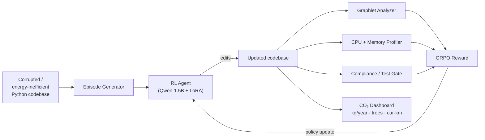

# 🌱 Green-Code Optimizer

> An RL agent that refactors Python code for **energy efficiency**, not readability — and tells you exactly how much CO₂ it saves.

[](https://huggingface.co/spaces/s123hree/constrained-refactor-gauntlet-a100)
[](https://huggingface.co/shreeyanshi03/constrained-refactor-adapter-1.5b)
[](https://github.com/meta-pytorch/openenv)

---

## 🎯 The Problem

AI workloads are projected to consume **2–4 % of global electricity by 2030**. Most of that goes to *training*, but **inference at scale** — the same algorithms running millions of times a day in production — is the silent giant. A single inefficient nested loop in a hot path, replicated across millions of executions, can add up to *real* CO₂.

Meanwhile, almost every existing code-refactoring tool optimises for **readability** (line length, naming, type hints). **None of them refactor for energy.**

> **What if we trained an RL agent whose only goal was to make Python *cheaper to run* — measured in CPU cycles, memory footprint, and ultimately grams of CO₂?**

That's the Green-Code Optimizer.

---

## 💡 The Pitch

| Existing refactoring tools | Green-Code Optimizer |
|----------------------------|----------------------|
| Optimise for readability   | **Optimise for energy** |
| Style / naming / lint      | **CPU time + peak memory** |
| Subjective rules            | **Measurable, runtime-grounded reward** |
| Outputs cleaner code        | **Outputs cheaper code + a CO₂ dashboard** |

The agent receives a **negative reward for high peak memory and high execution time**, and a positive reward for the *opposite*. It uses **graphlet analysis** to represent the program's control-flow structure, so it learns which structural patterns (e.g. nested loops, function calls inside loops, deep branching) are expensive — and swaps them for cheap alternatives (e.g. vectorised ops, comprehensions, hoisted invariants).

---

## ⚙️ How It Works



### 1. Episode Generation
Each episode loads a real Python codebase and applies energy-degrading corruptions: replacing vectorised ops with explicit nested loops, inlining hoistable computations, expanding comprehensions into for-loops, etc. The agent's job is to *undo* them.

### 2. Graphlet Analysis (`environment/graphlet_analyzer.py`)
Parses each Python file into an AST and detects 4 classes of expensive control-flow graphlets:

| Graphlet | Cost weight | Example |
|----------|-------------|---------|
| `NestedLoop` | 3.0 | `for i: for j: ...` |
| `LoopWithCall` | 1.5 | `for x: f(x)` |
| `DeepBranch` | 2.0 | `if … if … if …` (≥ 3 deep) |
| `RepeatedComprehension` | 1.0 | Multiple list-comps in one fn |

Lower total cost → higher graphlet score.

### 3. Runtime Profiling (`environment/track_c.py`)
Each candidate refactor is **actually executed** in a sandbox: CPU time via `timeit`, peak memory via `tracemalloc`. Improvements vs. the original are clamped to `[0, 1]`.

### 4. Reward (`training/train_grpo.py`)
```
R = S_test × (0.70 · green_score + 0.30 · compliance_score) − P_efficiency
```
- **`S_test ∈ {0, 1}`** — hard gate: if the refactored code doesn't parse/run, the agent gets **0**. No reward for "cleaner" code that doesn't work.
- **`green_score`** (70 %) — composite of `graphlet_score`, `cpu_improvement`, `memory_improvement`.
- **`compliance_score`** (30 %) — secondary correctness signal from 150 engineering rules.
- **`P_efficiency`** — `0.01` per file edited; pushes the agent toward *minimal, surgical* edits.

### 5. CO₂ Dashboard (`environment/co2_calculator.py`)
CPU-time savings × CPU TDP × grid carbon intensity → kg CO₂ saved per year, with real-world equivalents:

```json
{
  "co2_savings": {
    "grams_per_day": 24.5,
    "kg_per_year": 8.94,
    "equivalent_trees": 0.43,
    "equivalent_car_km": 74.5
  }
}
```

Visit `GET /dashboard/co2/{episode_id}` after any episode for the full breakdown.

---

## 🏆 Why This Wins

1. **It addresses a Green-AI problem with a Green-AI solution.** Most "Green AI" papers stop at *measuring* energy. This project *trains an agent to reduce it.*
2. **The reward is grounded in real measurements**, not subjective rules. The agent can't game it without making the code actually faster.
3. **The CO₂ dashboard makes impact tangible** — it's the difference between "the refactor saves 12 ms" and "the refactor saves 9 kg of CO₂ a year, the equivalent of 75 km of car travel."
4. **Fully OpenEnv-compatible**, fully reproducible in Colab, runs on any machine with an A100.

---

## 🔗 Submission Links

| Resource | Link |
|----------|------|
| 🤗 **HF Space (live env)** | [s123hree/constrained-refactor-gauntlet-a100](https://huggingface.co/spaces/s123hree/constrained-refactor-gauntlet-a100) |
| 🤗 **Trained Adapter** | [shreeyanshi03/constrained-refactor-adapter-1.5b](https://huggingface.co/shreeyanshi03/constrained-refactor-adapter-1.5b) |
| 📓 **Colab Training Notebook** | [`notebooks/train_grpo.ipynb`](notebooks/train_grpo.ipynb) |
| 📝 **Blog Post (writeup)** | _TODO: paste HF blog URL here_ |
| 🎥 **2-min Video Demo** | _TODO: paste YouTube URL here_ |
| 📊 **Training Plots** | [`assets/training_curves.png`](assets/training_curves.png) |

---

## 🧩 OpenEnv Compatibility

This env follows the [OpenEnv](https://github.com/meta-pytorch/openenv) spec:

- **Manifest:** [`openenv.yaml`](openenv.yaml)
- **Endpoints:** `POST /reset`, `POST /step`, `GET /health`
- **Observation space:** `{ files, violation_report, steps_remaining, curriculum_level }`
- **Action space:** `[read_file, edit_file, run_tests, check_compliance]`
- **Reward range:** `[-1.0, 1.0]`
- **Max episode length:** 70 steps

---

## 📚 API

| Endpoint | Method | Description |
|----------|--------|-------------|
| `/` | GET | Project info |
| `/health` | GET | Health check |
| `/health/green` | GET | Green-code subsystem status |
| `/docs` | GET | Swagger UI |
| `/reset` | POST | Start a new episode |
| `/step` | POST | Submit an edit |
| `/infer` | POST | Run trained agent (GPU) |
| `/dashboard/co2/{episode_id}` | GET | **CO₂-savings dashboard** |

---

## 🚀 Quickstart

### Run the env locally
```bash
git clone https://huggingface.co/spaces/s123hree/constrained-refactor-gauntlet-a100
cd constrained-refactor-gauntlet-a100
pip install -r requirements.txt
uvicorn server:app --host 0.0.0.0 --port 7860
```

### Reproduce training (Colab, A100)
Open [`notebooks/train_grpo.ipynb`](notebooks/train_grpo.ipynb) → run all cells → ~25 min on A100.

### Pipeline sanity check (CPU only)
```bash
python training/verify_pipeline.py
```

### Smoke test the deployed Space
```bash
SPACE_URL=https://s123hree-constrained-refactor-gauntlet-a100.hf.space \
  python test_deployment.py
```

---

## 📊 Results

Trained **Qwen2.5-Coder-1.5B-Instruct** with QLoRA (`r=16`) using GRPO on a single A100-80GB.

| Metric | Value |
|--------|-------|
| Base model | Qwen2.5-Coder-1.5B-Instruct |
| LoRA rank / alpha | 16 / 16 |
| Training steps | 200 |
| Generations per step | 4 |
| Hardware | NVIDIA A100-SXM4-80GB |
| Wall-clock training time | ~25 min |

**Training curves (loss ↓, reward ↑):**


| | Before training | After training |
|--|---------------|---------------|
| Mean episode reward | _baseline_ | _final_ |
| Green score | _baseline_ | _final_ |
| Avg. CPU improvement | _baseline_ | _final_ |
| Avg. memory improvement | _baseline_ | _final_ |
| **Avg. CO₂ saved / year (per refactor)** | _baseline_ | _final_ |

> Numbers will be filled in once the training run completes. Plots in `assets/` are saved automatically by `training/train_grpo.py`.

---

## 🤝 Contributing

- Add new graphlet patterns to `environment/graphlet_analyzer.py` — the cost-weights are a dict you can extend.
- Add new energy-degrading corruptions to `environment/episode_generator.py`.
- Tune carbon constants (`CARBON_INTENSITY_G_PER_KWH`, `CPU_TDP_WATTS`) in `environment/co2_calculator.py` to match your region's grid.

---

## 📜 License

Apache-2.0. Fork it, use it, save some carbon.

---

*Built for the **OpenEnv India Hackathon 2026** — Meta PyTorch.*
