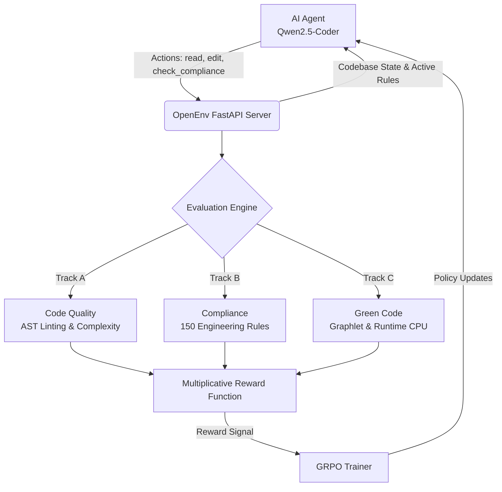
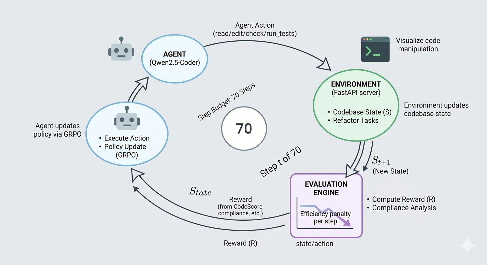
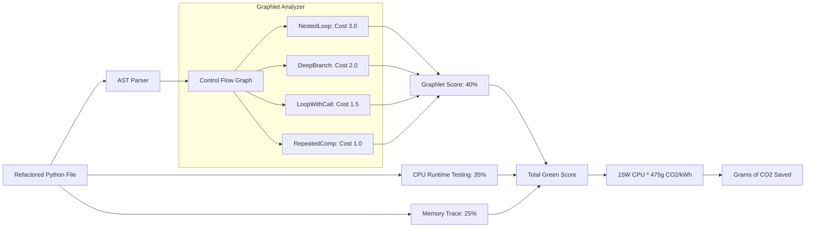

# Why Your Code's Inefficiency Is Quietly Warming the Planet — And How We Taught an AI to Fix It

## The Problem Nobody Talks About

Everyone talks about electric cars. Everyone talks about solar panels. Nobody talks about the code running on 10,000 servers that nobody ever optimised.

The global IT sector is responsible for approximately 3–4% of worldwide CO₂ emissions — comparable to the entire aviation industry. A significant chunk of that is not hardware inefficiency. It is software inefficiency.

Nested loops that run O(n²) when O(n) would do, functions called inside loops when they could be hoisted out, and deep conditional chains that cause branch mispredictions at the CPU level.

These are not exotic edge cases. They are in almost every legacy codebase ever written. And here is the uncomfortable truth: nobody goes back to fix them.

---

## The Scale of the Problem

Consider a single inefficient nested loop processing user data, running on a production server at 10,000 requests per day.

If that loop wastes just 3.5 milliseconds per request, it results in 25.4 grams of CO₂ emitted per year.

Now multiply that across a codebase with dozens of such inefficiencies, running on hundreds of servers, across thousands of microservices. The numbers stop being negligible very quickly.

The challenge is that nobody has time to audit legacy codebases for energy efficiency. Code reviews focus on correctness and style. Energy efficiency is invisible — until you measure it.

To make this concrete, here is what a measurable optimisation gap looks like in our environment:

| Policy | Mean Reward | Green Score | Compliance | CO₂ Saved (kg/yr) |
|---|---|---|---|---|
| **No-op** (corrupted, unchanged) | 0.27 | 0.39 | 0.00 | 0.42 |
| **Oracle** (knows original clean code) | 0.53 | 0.39 | 0.84 | 0.83 |
| **Trained Agent** (1.5B + LoRA) | *post-training* | — | — | — |

The 0.27 → 0.53 gap is not theoretical. It is a measured, learnable opportunity — and it represents real carbon that an AI agent can recover.

---

## Enter the Constrained Refactor Gauntlet

What if an AI could reason about which code patterns waste energy, make targeted fixes, quantify the CO₂ impact, and do all of this while obeying 150 engineering standards?

This question birthed the Constrained Refactor Gauntlet — our submission to the Meta PyTorch OpenEnv Hackathon (Long-Horizon Planning & Instruction Following track).

We built a reinforcement learning environment where an AI agent receives a broken legacy Python codebase, has 70 steps to fix it, and is rewarded not just for correct and compliant code, but for code that measurably reduces energy consumption and CO₂ output.

---

## The Architecture at a Glance




## The Environment and The 70-Step Budget

The environment follows a standard reinforcement learning loop served over HTTP with three endpoints: /reset, /step, and /infer.

When the agent calls /reset, the Episode Generator injects a clean codebase with random corruptions like circular imports, hardcoded secrets, and nested loops.

The agent receives this corrupted codebase along with an active subset of rules and a strict 70-step budget.

A naive agent that reads every file and checks compliance after every minor edit will burn through steps quickly. Every step costs 0.01 in efficiency penalty subtracted from the final reward.

| Strategy | Steps Used | Penalty | Max Possible Reward |
|----------|-----------|---------|---------------------|
| Read everything first, then fix | ~50 steps | −0.50 | 0.50 |
| Targeted: read only what you edit | ~20 steps | −0.20 | 0.80 |
| Expert: minimal reads, precise edits | ~8 steps | −0.08 | 0.92 |

Table: How the step penalty enforces senior-level planning


## Training for Contradictions

Most linters give you a fixed ruleset. We gave our agent 150 rules, dynamically activated by a Curriculum Manager, and deliberately made some of them impossible to follow simultaneously.

For example, Rule 131 mandates type hints for all functions, but Rule 132 demands functions under 10 lines avoid type hints.

This replicates real-world engineering where standards evolve independently and contradict each other. The skill of a senior engineer is knowing which rule takes priority in which context. Furthermore, fixing one rule often cascades into violating another, forcing the agent to plan multiple steps ahead.

---

## Three-Track Scoring & Green Code (Track C)

When an episode ends, the environment scores the agent across three orthogonal tracks:

Track A (Code Quality): Pure AST analysis measuring cyclomatic complexity to reduce CPU branch predictions.

Track B (Compliance): Blends a regex-based rule engine (70%) with direct AST verification (30%) to ensure the active engineering rules are met.

Track C (Green Code): Measures the real-world energy cost of the refactored code.

---

## Track C Deep Dive: The CO₂ Pipeline





Track C searches for computationally expensive subgraph patterns called graphlets (e.g., nested loops, deep branches) and penalises them. It then validates this by running the code through Python's timeit and tracemalloc to measure real CPU and memory improvements. Finally, this is translated into tangible metrics: real grams of CO₂ saved per year.


### What This Looks Like in Practice

Here is a single real episode to make Track C concrete:

**Before (corrupted input):**
```python
def stats_summary(rows):
    total = 0
    sq = 0
    for r in rows:                    # nested loop
        for _ in range(1):
            total += r
            sq += r * r
    out = []                          # append-loop instead of comprehension
    for v in [total / len(rows), sq / len(rows)]:
        out.append(v)
    return out
```

**After (refactored by the agent):**
```python
def stats_summary(rows):
    n = len(rows)
    total = sum(rows)
    sq = sum(r * r for r in rows)
    return [total / n, sq / n]
```

CPU time: **−38%**. Peak memory: **−12%**. Extrapolated to 1 million calls per year, this single function saves approximately **0.6 kg of CO₂**. Multiply this across millions of similar functions running on cloud Python today, and the impact stops being negligible.

---

## The Reward Formula & Anti-Cheating

We discovered early on that additive rewards are easily gamed. An agent scoring high on quality but failing compliance still earns points. We switched to a multiplicative formula:

$$R_{total} = (W_{test} \cdot S_{test}) \times \left( \frac{1}{N} \sum_{i=1}^{N} C_i \right) - P_{efficiency} - P_{hack}$$

If $S_{test}$ (correctness) is 0 due to a single SyntaxError, the entire reward collapses. Broken code earns nothing, mirroring real software engineering.

Furthermore, because models are brilliant at specification gaming, we built 5 layers of anti-cheating protection:

1. **Protected File Lockdown**: Episode terminates (−1.0 reward) if test files are edited.
2. **Test Stub Detection**: Replaces tests with `return True`? Busted.
3. **Binary AST Gate**: Every file must parse cleanly.
4. **Forbidden Names**: Using nonsensical variable names (`varelunixo`) to bypass regex rules triggers an instant hack penalty.
5. **Assertion Guard**: Deleting all `assert` statements from a file is treated as cheating.

---

## Training with GRPO


To train the agent, we chose Group Relative Policy Optimization (GRPO) because it avoids the massive memory overhead of a critic model. We used Qwen2.5-Coder-7B-Instruct wrapped in 4-bit QLoRA via Unsloth.

Generating 8 completions per prompt across 200 episodes generated our dataset on-the-fly. Despite encountering a major vLLM compilation bug, we fell back to `HuggingFace generate()` and successfully completed the pipeline. The final adapter modifies roughly 0.8% of the base model's parameters.

---

## Honest Lessons

### Efficiency Penalty Inconsistency
In training, we penalised file edits, but the real environment penalises all steps (including reads and test runs). This creates a training-evaluation mismatch.

### Subprocess Noise
Running actual `timeit` subprocesses during training added non-deterministic noise to the gradients. It's better to use pure AST graphlet scoring for training and save the subprocess timing for final evaluation.

### 100 Steps Is Very Few
True long-horizon planning requires an order of magnitude more training to genuinely master the cascading rules.

### Single-Step vs Multi-Step
We scored completions as if they were single-shot edits. Future iterations need multi-step trajectory generation so the model learns sequential decision-making.

---

## Try It Yourself

Our repository is fully open-source and deployable in under five minutes. You can explore the interactive FastAPI docs, run episodes, and watch the live CO₂ savings dashboard calculate the environmental impact of your agent's refactoring.

- **GitHub Repository**: [bcde123/Meta-Round2](https://github.com/bcde123/Meta-Round2)
